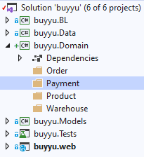
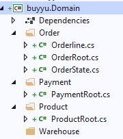

# Domain Driven Design

In dit hoofdstuk trachten we drie technische componenten van DDD te implementeren:

1. Aggregate root
2. Invariants
3. Value objects

Eerst en vooral nog eens benadrukken dat DDD veel breder is dan deze technische implementaties. Het gaat om design, over het modeleren van een probleem naar een oplossing. Het ecosysteem van DDD is door de jaren heen ook stevig gegroeid. Bijvoorbeeld, het is belangrijk dat developers dezelfde duidelijke en ondubbelzinnige taal spreken als de business, daarom is het techno-sociale aspect ook heel belangrijk.

Uit het modeleren, bijvoorbeeld door gebruik van Event Storming [1], komen een aantal Bounded Contexten te voorschijn. Binnen deze Bounded Context spreekt men eenzelfde taal, die kan verschillen van een andere Bounded Context ook al is die in dezelfde oplossing opgenomen. Bijvoorbeeld: als je een koffie besteld in Rome krijg je wellicht een straffe koffie in een kleine tas, terwijl je in New York een grote beker met zoetere koffie krijgt. Of dichter bij huis, het verschil van het woord bank en zetel bij Vlamingen en Nederlanders. Met andere woorden, taal heeft zijn grenzen.
Een product voor de marketing afdeling is voor hun alles wat gerelateerd is met de product catalogus, terwijl voor de pricing manager enkel de prijs telt, en voor de magazijnier hoeveel items van dat product nog in stock zijn.
Vertaald naar het technische spreken we niet meer van een Bounded Context, maar van een Aggregate. Deze Aggregate bestaat uit één of meerdere domain entities die als het ware aan elkaar hangen. Per Aggregate is er ook één Aggregate Root. In principe gebeuren alle acties in een Aggregate, altijd via de Aggregate Root. 
In ons model hebben we een Order en verschillende Orderlines die daaronder hangen. Een Orderline kan niet bestaan zonder een Order en als we een Orderline willen toevoegen, aanpassen of verwijderen, dan gaan we de dit altijd doen via de Order en nooit rechtstreeks op de Orderline.

Een belangrijke taak van de Aggregate Root is ook om te controleren of hij altijd in een valid state is. Als bijvoorbeeld de Order status aangepast wordt naar confirmed, dan moéten er Orderlines zijn. Deze validatieregels zijn direct te mappen met de business rules, en daarom horen ze ook thuis in de Aggregate Root en we noemen ze Invariants. 
Deze regels worden ook in de front-end afgedwongen.
Er zijn ook regels die buiten de context vallen, zoals de controle of er wel genoeg stock aanwezig is vooraleer een Order kan verzonden worden. Deze kunnen perfect een laag hoger afgedwongen worden, aangezien dit ook deel uitmaakt van DDD. 

Soms zijn er validatieregels die zeer gericht zijn tot één property. Soms is zijn er ook properties die een groep kunnen zijn, zoals Streetname, Housenumber, PostalCode en City wat kan samengenomen worden tot Address. Voor deze (en meer) gevallen, kan je gebruik maken van Value objects. In tegenstelling tot domain entiteiten die een identity property hebben (vb ID), hebben Value objects geen identity property. Hun identiteit wordt verkregen door hun waarde. Bijvoorbeeld: 5 euro is 5 euro. De eerste 5 euro echter is samengesteld door 5 stukken van 1 euro, en de tweede 5 euro is een biljet van 5 euro. 
Value objects zijn ook immutable en we maken ze aan via een factory method, waar we al validaties kunnen uitvoeren.

Hoog tijd om deze concepten toe te passen in ons project.

## Buyyu project

### Aanmaak domain project

Momenteel bevat het data project zowel de domain entities als de DbContext. Deze laatste is infrastructure, de link tussen onze code en de database. Daarom is het beter om dit apart te trekken, en we maken hiertoe een nieuw project buyyu.Domain aan.

Als we kijken naar het project, kunnen we de volgende Bounded Contexten onderscheiden:

- Order
- Product
- Warehouse
- Payment

We maken hiervoor folders aan in het nieuwe project.

Even een herinnering dat we enkel Order hebben uitgewerkt. De andere Bounded Contexten zijn niet helemaal uitgewerkt. Je kan je inbeelden dat we onze producten catalogus willen uitbreiden of aanpassen, terwijl we nu enkel deze bevragen.

Verplaats nu de domain entities van het data project naar de juiste mappen en pas de namespaces en referenties aan. Wat ik ook meestal doe, is de class dat als root gaat fungeren postfixen met 'Root', zodat het meteen opvalt, en ook zodat we namespace volgens de mappenstructuur kunnen behouden.

Warehouse is momenteel nog leeg en dit gaan we momenteel zo laten. Ook is er nog een probleem tussen Payment, wat in het bedrijf geregeld wordt door het financiële departement, en Order, wat geregeld wordt door de order desk. Order heeft namelijk een lijst van Payments, en een PaidAmount. De lijst van Payments halen we uit Order en we gaan de werking ervan ook wat aanpassen in de volgende stappen.
We merken nu dat uitgaande van ons database design als start, we nu onze implementatie van DDD niet volledig kunnen doen. We hebben ProductRoot als referentie in onze Order, dus we zijn momenteel verplicht om "te mixen".

### DDD root base class

## Unit testen

## Taken

1. Pas nu alle andere domain entiteiten aan zodat deze voldoen aan de encapsulation regels uitgelegd in dit hoofdstuk.
2. Pas de unit tests aan zodat deze werkende blijven.
3. Test of de applicatie nog werkt zoals voorheen

## Volgende stap

In de volgende stap gaan we meer technische componenten van DDD inbouwen zoals een aggregate root, valueobjects en invariants.

## Referenties

[1]: https://www.eventstorming.com/	"Event Storming (Brandolini)"

