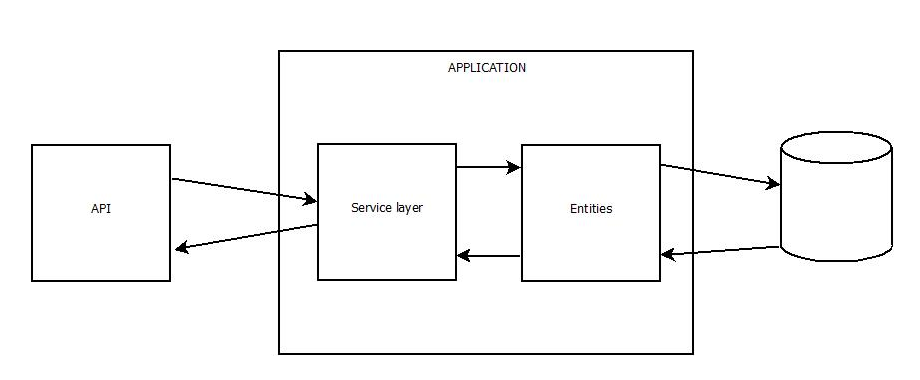

# CQRS

Command Query Responsibililty Segregation [1] is een pattern waarbij het model dat wordt gebruikt om informatie te lezen, wordt gescheiden van het model dat wordt gebruikt om informatie bij te werken. In een meer traditionele architectuur wordt één enkel objectmodel gebruikt om zowel gegevens te lezen als bij te werken:



Compromissen worden noodzakelijk om een enkel objectmodel te gebruiken, aangezien domein-klassen nodig zijn om alle doeleinden te dienen. Dezelfde representatie van een entiteit moet alle CRUD operaties ondersteunen, waardoor ze groter worden dan ze in alle omstandigheden moeten zijn.
Bovendien zijn aanpassingen van state veel kleiner dan reads, waardoor de noden voor op te schalen ook anders zijn.

Eén manier om dit te overwinnen is het gebruik van een enkel object-model voor queries (Read) en commands (Create, Update, Delete). 

Een optimalisatie hierop, al is dit geen verplichting, is het gebruik van verschillende databases voor het query en command model. Deze databases moeten dan natuurlijk wel in sync gehouden worden. De vorm en manier waarop data in de verschillende modellen worden opgeslagen kunnen ook verschillen. Het is niet zo dat als een aanpassing gebeurt, command dus, de hele database gekopieerd wordt naar het query model. In de command-zijde  gaan we bijvoorbeeld enkel een event stream bijhouden van welke commands er allemaal zijn aangeroepen, en deze opnieuw naspelen om een domein object terug op te bouwen. Deze events, als ze origineel worden aangeroepen, triggeren event handlers die dto's aanmaken in NoSql databases. Bijvoorbeeld een dto om een overzicht grid van orders te vullen en een dto om een order te bekijken. Dit leidt tot redundante data, waar een RDBMS via normaal vormen ons duwt om zo weinig mogelijk disk ruimte in te nemen. Echter, dit stamt vanuit een tijd dat disk ruimte nog duur was. Door het verminderen van joins die we moeten schrijven, kunnen we ook sneller data terug geven aan de gebruiker en we kunnen ook optimaliseren naar gebruik: we kunnen dto's die frequent gebruikt worden wegschrijven in een Redis Cache en data die gebruikt wordt voor analyse naar een data warehouse.

In dit hoofdstuk gaan we momenteel nog niet zo ver, maar het is belangrijk te weten dat deze stappen mogelijk zijn als we CQRS nog willen optimaliseren. We gaan basis CQRS implementeren door de commands en queries in aparte classes te steken. SOLID-gewijs gaan we met het Single Responsibility principe per use case een aparte class hebben, die enkel doet waar de use case over gaat.

We gaan ook de infrastructure layer loskoppelen van onze business logic door het mediatior pattern, meer bepaald gebruik makende van Mediatr [2] van Jimmy Bogard


## Buyyu project

### MediatR

Installeer Nuget package MediatR.Extensions.Microsoft.DependencyInjection in het web project. Voor andere projecten waar we MediatR gaan gebruiken is enkel basis package voldoende.

In het web project gaan we via reflection de assemblies scannen op zoek naar handlers via de volgende code:

```c#
public static IServiceCollection AddMediatrOnUseCases(this IServiceCollection services)
{
	var loadedAssemblies = AppDomain.CurrentDomain.GetAssemblies().ToList();
	var loadedPaths = loadedAssemblies.Select(a => a.Location).ToArray();

	var referencedPaths = Directory.GetFiles(AppDomain.CurrentDomain.BaseDirectory, "*.BL.dll").ToList();

	var toLoad = referencedPaths.Where(r => !loadedPaths.Contains(r, StringComparer.InvariantCultureIgnoreCase)).ToList();

	toLoad.ForEach(path => loadedAssemblies.Add(AppDomain.CurrentDomain.Load(AssemblyName.GetAssemblyName(path))));

	var useCaseAssemblies = AppDomain.CurrentDomain.GetAssemblies().Where(x => x.GetName().Name.EndsWith(".BL")).ToArray();

	services.AddMediatR(useCaseAssemblies);

	return services;
}
```

Gebruik in Startup.cs:

```c#
services.AddMediatrOnUseCases();
```

### Requests: commands en queries

In het models project plaatsen we de dtos in een aparte folder en we voegen twee nieuwe folders er aan toen: commands en queries. Objecten van deze classes gaan dienen voor de communicatie van de infrastructuur laag (de controllers) naar de binnenste lagen, maar ook om later events te dispatchen waarop andere bounded contexten kunnen op reageren.

Volgende command is voor het aanmaken van een order:

```c#
public sealed class CreateOrderCommand : IRequest
{
	public CreateOrderCommand(Guid orderId, Guid clientId, List<OrderLineCommand> orderLines)
	{
		OrderId = orderId;
		ClientId = clientId;
		OrderLines = orderLines;
	}

	public Guid OrderId { get; }
	public Guid ClientId { get; }
	public List<OrderLineCommand> OrderLines { get; }

	public sealed class OrderLineCommand
	{
		public OrderLineCommand(Guid productId, int quantity)
		{
			ProductId = productId;
			Quantity = quantity;
		}

		public Guid ProductId { get; }
		public int Quantity { get; }
	}
}
```

Omdat deze type van klasses ook apart staan, zeg maar in een soort messages project, is er ook geen harde koppeling met de effectieve implementatie. Communicatie gebeurt door een object als een soort message op een interne queue te plaatsen.

### Handlers

Het volgende is een eerste opzet van een handler:

```c#
public class CreateOrderCommandHandler : IRequestHandler<CreateOrderCommand>
{
	private readonly IOrderRepository _orderRepository;
	private readonly IProductRepository _productRepository;

	public CreateOrderCommandHandler(IProductRepository productRepository, IOrderRepository orderRepository)
	{
		_productRepository = productRepository;
		_orderRepository = orderRepository;
	}

	public async Task<Unit> Handle(CreateOrderCommand command, CancellationToken cancellationToken)
	{
		var newOrder = OrderRoot.Create(OrderId.FromGuid(command.OrderId), ClientId.FromGuid(command.ClientId));
		foreach (var orderline in command.OrderLines)
		{
			var product = await _productRepository.GetProduct(orderline.ProductId);
			newOrder.AddOrderline(ProductId.FromGuid(product.Id), product.Price, Quantity.FromInt(orderline.Quantity));
		}

		await _orderRepository.AddSave(newOrder);

		return await Unit.Task;
	}
}
```

Een command handler geeft geen data terug, daarom maken we er een Task<Unit> return type van, wat zoveel wilt zeggen als void.

Maar command handlers hebben altijd hetzelfde patroon:

1. Ophalen van de aggregate root (bij update en delete)
2. Het aanroepen van methods van de aggregate root
3. Het bewaren van de aggregate root

We kunnen deze stappen faciliteren door het gebruik van een base class:

```c#
public abstract class CommandHandler<TCommand, TAggregate, TKey> : IRequestHandler<TCommand>
	where TAggregate : AggregateRoot<TKey>
	where TCommand : IRequest
	where TKey : Value<TKey>
{
	protected CommandHandler(
		IRepository<TAggregate, TKey> repo,
		HandlerTypeEnum handlerType)
	{
		Repo = repo;
		CommandType = handlerType;
	}

	public IRepository<TAggregate, TKey> Repo { get; }
	public TKey AggregateId { get; protected set; }
	public TAggregate AggregateRoot { get; protected set; }
	private HandlerTypeEnum CommandType { get; }

	public bool skipSave = false;
	private bool isDeleted = false;

	public async Task<Unit> Handle(TCommand command, CancellationToken cancellationToken)
	{
		if (CommandType == HandlerTypeEnum.Update)
		{
			//Execute prehandle method to get aggregateId
			var preHandleMethod = GetHandleMethod(command, HandleMethodType.PreHandle);

			try
			{
				preHandleMethod.Invoke(this, new object[] { command });
			}
			catch (TargetInvocationException targetInvocationException)
			{
				throw targetInvocationException.InnerException;
			}
			catch (Exception)
			{
				throw;
			}

			AggregateRoot = await GetAggregateFromRepo();
		}

		try
		{
			await Apply(command);

			if (AggregateRoot != null)
			{
				if (!isDeleted)
				{
					if (!skipSave)
					{
						if (CommandType == HandlerTypeEnum.Create)
						{
							await Repo.Add(AggregateRoot);
						}
						else
						{
							await Repo.Save(AggregateRoot);
						}
					}
				}
			}
		}
		catch (TargetInvocationException targetInvocationException)
		{
			throw targetInvocationException.InnerException;
		}
		catch (Exception ex)
		{
			throw;
		}

		return await Unit.Task;
	}

	protected async Task DeleteAggregateRoot()
	{
		isDeleted = true;
		await Repo.Delete(AggregateRoot);
	}

	protected async Task<TAggregate> GetAggregateFromRepo()
	{
		return await Repo.Load(AggregateId);
	}

	protected abstract Task Apply(TCommand command);

	private MethodInfo GetHandleMethod(TCommand command, HandleMethodType handleMethodType)
	{
		//Get the handle methods
		var handleMethod = this.GetType().GetMethod(
				Enum.GetName(typeof(HandleMethodType), handleMethodType),
				BindingFlags.Instance | BindingFlags.NonPublic,
				Type.DefaultBinder,
				new Type[] { command.GetType() },
				null);

		if (handleMethod == null)
		{
			throw new MissingMethodException($"Handle method with event { command.GetType()} is missing");
		}

		return handleMethod;
	}

	private enum HandleMethodType
	{
		Handle,
		PreHandle
	}

	protected enum HandlerTypeEnum
	{
		Update,
		Create
	}
}
```

De Handle method wordt opgeroepen via MediatR en is dus ons startpunt. Indien dit een update commandhandler is (zie verder) dan wordt er eerst een PreHandle method uitgevoerd, waarbij de developer de kans krijgt om aan te duiden wat de Id is van de aggregate root waar deze use case om draait.
Vervolgens wordt dan via de repository deze aggregate root uit de database opgehaald.

Daarna verwacht de base class dat de developer een Apply(command) methode heeft geïmplementeerd, waar de nodige controles naar buiten (dus buiten de bounded context / aggregate) doet. Bijvoorbeeld bij het verzenden van een order gaat het magazijn nog eerst controleren of deze order wel bevestigd is. De aanpassingen aan de aggregate gebeuren via de calls in de aggregate root die in vorige hoofdstukken zijn aangemaakt.

Tenslotte worden de nodige acties uitgevoerd op de repository: aanpassen, toevoegen of verwijderen.

Om te bepalen of dit een create of update use case is worden hierboven nog twee andere command handlers geplaatst:

```c#
public abstract class CreateCommandHandler<TCommand, TAggregate, TKey> : CommandHandler<TCommand, TAggregate, TKey>
		where TAggregate : AggregateRoot<TKey>
		where TCommand : IRequest
		where TKey : Value<TKey>
{
	protected CreateCommandHandler(IRepository<TAggregate, TKey> repo)
		: base(repo, HandlerTypeEnum.Create)
	{
	}
}

public abstract class UpdateCommandHandler<TCommand, TAggregate, TKey> : CommandHandler<TCommand, TAggregate, TKey>
	where TAggregate : AggregateRoot<TKey>
	where TCommand : IRequest
	where TKey : Value<TKey>
{
	protected UpdateCommandHandler(IRepository<TAggregate, TKey> repo)
		: base(repo, HandlerTypeEnum.Update)
	{ }

	protected abstract void PreHandle(TCommand command);
}
```

De command handler die we hierboven gemaakt hebben kan aangepast worden naar:

```c#
public class CreateOrderCommandHandler : CreateCommandHandler<CreateOrderCommand, OrderRoot, OrderId>
{
	private readonly IProductRepository _productRepository;

	public CreateOrderCommandHandler(
		IProductRepository productRepository,
		IRepository<OrderRoot, OrderId> orderRepository)
			: base(orderRepository)
	{
		_productRepository = productRepository;
	}

	protected async override Task Apply(CreateOrderCommand command)
	{
		AggregateRoot = OrderRoot.Create(OrderId.FromGuid(command.OrderId), ClientId.FromGuid(command.ClientId));
		foreach (var orderline in command.OrderLines)
		{
			var product = await _productRepository.GetProduct(orderline.ProductId);
			AggregateRoot.AddOrderline(ProductId.FromGuid(product.Id), product.Price, Quantity.FromInt(orderline.Quantity));
		}
	}
}
```

Een update command handler ziet er als volgt uit, met de PreHandle method waarbij de AggregateId gezet wordt:

```c#
public sealed class UpdateOrderCommandHandler : UpdateCommandHandler<UpdateOrderCommand, OrderRoot, OrderId>
{
	private readonly IProductRepository _productRepository;

	public UpdateOrderCommandHandler(
		IRepository<OrderRoot, OrderId> repo,
		IProductRepository productRepository)
		: base(repo)
	{
		_productRepository = productRepository;
	}

	protected override void PreHandle(UpdateOrderCommand command)
	{
		AggregateId = OrderId.FromGuid(command.OrderId);
	}

	protected async override Task Apply(UpdateOrderCommand command)
	{
		//Remove orderlines
		var toRemoveOrderlineProducts = AggregateRoot.Lines.Select(ol => ol.ProductId.Value).Except(command.OrderLines.Select(ol => ol.ProductId));
		foreach (var toRemoveOrderlineProduct in toRemoveOrderlineProducts)
		{
			AggregateRoot.RemoveOrderline(ProductId.FromGuid(toRemoveOrderlineProduct));
		}

		//Update orderlines
		var toUpdateOrderlineProducts = command.OrderLines.Select(ol => ol.ProductId).Intersect(AggregateRoot.Lines.Select(ol => ol.ProductId.Value));
		foreach (var toUpdateOrderlineProduct in toUpdateOrderlineProducts)
		{
			var dtoOrderline = command.OrderLines.First(ol => ol.ProductId == toUpdateOrderlineProduct);
			var product = await _productRepository.GetProduct(toUpdateOrderlineProduct);
			AggregateRoot.UpdateOrderline(ProductId.FromGuid(product.Id), product.Price, Quantity.FromInt(dtoOrderline.Qty));
		}

		//Add orderlines
		var toAddOrderlineProducts = command.OrderLines.Select(ol => ol.ProductId).Except(AggregateRoot.Lines.Select(ol => ol.ProductId.Value));
		foreach (var toAddOrderlineProduct in toAddOrderlineProducts)
		{
			var dtoOrderline = command.OrderLines.First(ol => ol.ProductId == toAddOrderlineProduct);
			var product = await _productRepository.GetProduct(toAddOrderlineProduct);
			AggregateRoot.AddOrderline(ProductId.FromGuid(product.Id), product.Price, Quantity.FromInt(dtoOrderline.Qty));
		}
	}
}
```

Door voortschrijdend inzicht over het domein is het duidelijk geworden dat er een context missende was: Shipment. Deze is inmiddels toegevoegd en stuurt het magazijn en de order aan. Het gebrek van opmaken van een degelijk model samen met de domain experten maakt dat er een fout in ons schema is gekropen. 

Naast command handlers zijn er ook query handlers. Het query object ziet er als volgt uit:

```c#
public class GetOrderDtoQuery : IRequest<OrderDto>
{
	public GetOrderDtoQuery(Guid orderId)
	{
		OrderId = orderId;
	}

	public Guid OrderId { get; }
}
```

En de query handler als volgt:

```c#
public class GetOrderDtoQueryHandler : IRequestHandler<GetOrderDtoQuery, OrderDto>
{
	private readonly IOrderRepository _orderRepository;

	public GetOrderDtoQueryHandler(IOrderRepository orderRepository)
	{
		_orderRepository = orderRepository;
	}

	public async Task<OrderDto> Handle(GetOrderDtoQuery request, CancellationToken cancellationToken)
	{
		return await _orderRepository.GetOrderDto(request.OrderId);
	}
}
```

### Infrastructure layer: data

Ook in de infrastructure layer trekken we de CQRS door: 

- er zijn nu aparte modellen voor commands en queries. Voor de commands gebruiken we de domain objecten, voor queries de dto's.
- er zijn aparte repositories. Voor commands implementeren we de IRepository<TAggregate, TKey> en we verwijderen alle methodes die te maken hebben met de domein objecten uit de reeds bestaande repositories.

De order repository voor de command handlers ziet er nu als volgt uit:

```c#
public class OrderRepository : IRepository<OrderRoot, OrderId>
{
	private readonly BuyyuDbContext _context;

	public OrderRepository(BuyyuDbContext context)
	{
		_context = context;
	}

	public async Task Add(OrderRoot aggregateRoot)
	{
		_context.Add(aggregateRoot);
		await _context.SaveChangesAsync();
	}

	public async Task Delete(OrderRoot aggregateRoot)
	{
		_context.Remove(aggregateRoot);
		await _context.SaveChangesAsync();
	}

	public async Task<OrderRoot> Load(OrderId aggregateId)
	{
		return await _context.Orders.Include(x => x.Lines).FirstAsync(x => x.Id == aggregateId);
	}

	public async Task Save(OrderRoot aggregateRoot)
	{
		await _context.SaveChangesAsync();
	}
}
```

### Infrastructure layer: controllers

Bij de controllers mogen we alle interfaces van de services verwijderen (en de services zelf ook als de handlers allemaal zijn geïmplementeerd). We gebruiken nu de command en query objecten om de handlers ervan aan te roepen via MediatR:

```c#
private readonly IMediator _mediator;

public OrderController(IMediator mediator)
{
	_mediator = mediator;
}

[HttpGet]
[Route("/{id}")]
public async Task<OrderDto> GetOrder(Guid id)
{
	return await _mediator.Send(new GetOrderDtoQuery(id));
}

[HttpPost]
public async Task<OrderDto> CreateOrder(OrderDto order)
{
	order.OrderId = Guid.NewGuid();

	var orderlineCommands = order.Orderlines.Select(x => new CreateOrderCommand.OrderLineCommand(x.ProductId, x.Qty)).ToList();
	var command = new CreateOrderCommand(order.OrderId, order.ClientId, orderlineCommands);
	await _mediator.Send(command);

	return await GetOrder(order.OrderId);
}
```

### Unit testen

Ook kunnen de unit testen nu per use case geschreven worden.

```c#
[Test]
public async Task CreateNormalOrder()
{
	//Arrange
	var orderId = OrderId.FromGuid(Guid.NewGuid());
	var clientId = ClientId.FromGuid(Guid.NewGuid());
	var productId = ProductId.FromGuid(Guid.NewGuid());
	var qty = Quantity.FromInt(10);
	var orderlines = new List<CreateOrderCommand.OrderLineCommand> { new CreateOrderCommand.OrderLineCommand(productId, qty) };
	var command = new CreateOrderCommand(orderId, clientId, orderlines);
	var mockOrderRepo = new Mock<IRepository<OrderRoot, OrderId>>();
	var mockProductRepo = new Mock<IProductRepository>();

	mockProductRepo.Setup(x => x.GetProduct(productId)).ReturnsAsync(
		new ProductRoot(
			productId,
			ProductName.FromString("Dummy"),
			Description.FromString("Lorem ipsum dolor sit amet, consectetur adipiscing elit"),
			Money.FromDecimalAndCurrency(10, "EUR")));

	var sut = new CreateOrderCommandHandler(mockProductRepo.Object, mockOrderRepo.Object);

	//Act
	await sut.Handle(command, CancellationToken.None);

	//Assert
	mockOrderRepo.Verify(x => x.Add(It.Is<OrderRoot>(
		or => 
		or.ClientId == clientId
		&& or.Id == orderId
		&& or.Lines.Count == 1
		&& or.Lines[0].Price.Amount == 10
		&& or.Lines[0].ProductId == productId
		&& or.Lines[0].Qty == 10
		&& or.PaidAmount.Amount == 0m
		&& or.State == OrderState.OrderStateEnum.NEW
		&& or.TotalAmount.Amount == 100m)));
}
```

We hebben nu testen op de kleinste units: de value objecten, dan op de aggregate root, en nu ook op de handlers. 

## Taken

1. Voer Update-Database uit om de database configuratie aan te passen. 

## Volgende stap

In het volgende hoofdstuk gaan we verder met het loskoppelen van functionaliteit. Mailservice wordt nog telkens aangeroepen in de command handler zelf, zelfs voor de aggregate root werd opgeslagen in de database! Ook de communicatie tussen de aggregates kan beter. We doen dit met domain events en handlers hierop, zodoende maken we een event driven applicatie.

## Referenties

[1]: https://cqrs.files.wordpress.com/2010/11/cqrs_documents.pdf	"CQRS Documents by Greg Young"
[2]: https://github.com/jbogard/MediatR	"MediatR"

