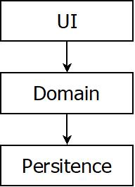
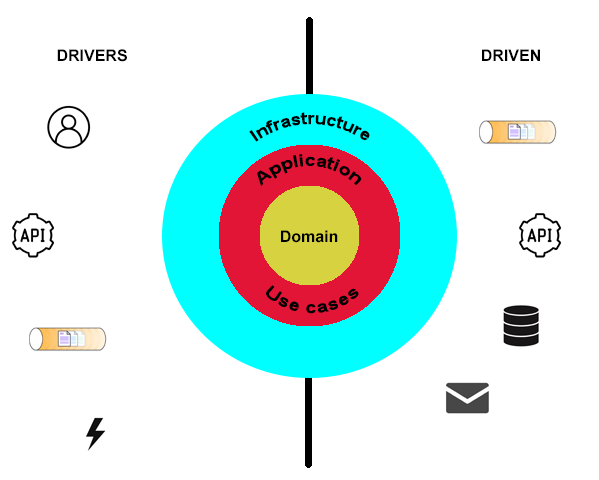
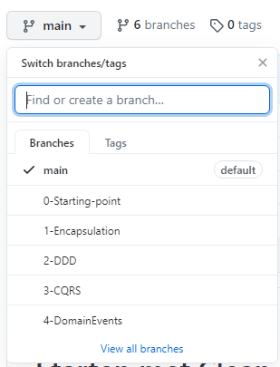
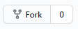
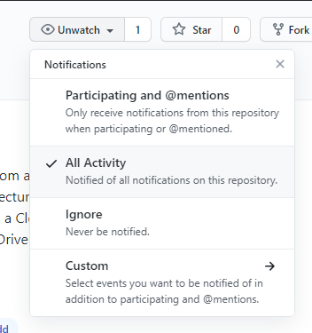

# Starten met Clean Architecture en Domain Driven Design

In deze repository gaan we stap voor stap een bestaande applicatie ombouwen gebruik makende van aanbevolen patterns en architecturen zoals Clean Architecture en Domain Driven Design (DDD).

Onder Clean Architecture verstaan we software design die als doel heeft om zogenaamde loosely coupled application components te bouwen. De drie meest bekende en beschreven vormen zijn:

- Hexagonal architecture, Alistar Cockburn, 2005
- Onion Architecture, Jeffrey Palermo, 2008
- Clean Architecture, Robert Martin, 2012

Clean Architecture is een tegenreactie op de alom gebruikte layered of n-tier architecture, een architectuurvorm waarmee we bekend zijn, in gedrild zijn en die alom beschreven is. Deze architectuurvorm is, wanneer ze goed opgebouwd wordt, een zeer goede oplossing voor vele projecten. 
Echter, zijn er ook een aantal nadelen verbonden aan deze architectuurvorm:

- Het stimuleert het gebruik van een Database-Driven Design. De verschillende lagen steunen op elkaar met een neerwaartse verbondenheid. Dit resulteert in de praktijk dat de developers eerst nadenken over hoe ze een databasemodel moeten opbouwen. Echter, de business wilt dat we een probleem oplossen voor hun, en zij spreken in termen van gedrag, niet "state". Met de opkomst van de Object-Relational Mapping (ORM) frameworks heeft deze werkwijze nog een extra boost gekregen.
- Grenzen worden niet meer goed bewaakt. Domain layer, waar uw business logic uiteindelijk zit, kan aan de entities om deze te manipuleren op state.  Het hele idee achter encapsulation, toch één van de vier pijlers van Object Oriented Programming, wordt op deze manier genegeerd. Maar ook als de Domain layer rechtstreeks de entities gaat kunnen aanspreken en er mee werken is er een sterke koppeling ontstaan tussen deze beide delen. 
- Het is makkelijker om shortcuts te nemen. In principe houdt niets een developer tegen om van een hoger liggende laag een stap over te slagen en direct te werken met entities in de laagste laag. Ook al is dit een bewuste én éénmalige shortcut, de volgende developer kan deze shortcut interpreteren als een normaal gedrag en dit herhalen.
- Wanneer de applicatie groeit en er zijn een aantal shortcuts genomen, is het ook moeilijker om testen te schrijven aangezien bepaalde delen niet meer makkelijk te mocken zijn. Al te dikwijls merk je dat ook gewerkt wordt met het static aanroepen van methodes in een lagere laag, ook al zijn het helper classes, die dan ook weer gebruik maken van onderdelen in een lager liggende laag.

Wat willen we dan wel bereiken? Clean Architecture wordt voorgesteld door een aantal concentrische cirkels:

De linkerkant zijn de drivers van onze applicatie. Dit kunnen gebruikers zijn die op een knop drukken in een web applicatie, een andere API die data nodig heeft van onze applicatie, een queue waar onze applicatie op luistert, of andere triggers die afgaan.

Van zodra er een actie aanvraag wordt ontvangen is het de taak van de infrastructure-laag om deze te vertalen en naar een binnenste laag door te geven. In de applicatie-laag vinden we onder andere de use cases, die dus te mappen zijn naar het gedrag dat de gebruiker wilt. Het kan zijn dat deze laag terug aan de rechterkant een connectie maakt met de infrastructure-laag, bijvoorbeeld met een repository met de vraag om data op te halen in de database.

Naar gelang van wat er beschreven staat in de use case kan een actie op de linkerkant een reactie ontlokken aan de rechterkant, deze kant wordt dan ook "driven by" onze applicatie. We kunnen één of meerdere messages in een queue steken, een andere API oproepen, gegevens uit een database halen, een e-mail gaan sturen, enz.

Wat belangrijk is dat de buitenste lagen, implementatie-details vertegenwoordigen. Voor de binnenste laag maakt het niet uit welke database of welke mailserver er gebruikt wordt, de infrastructure-laag neemt dit voor zijn rekening. Met deze opzet is het ook duidelijk dat dit geen database-driven design is. Hoe langer we beslissingen van de implementatie-details kunnen uitstellen, en ons meer kunnen concentreren op de echte waarde, dus de binnenste lagen, hoe beter.

Waar past Domain Driven Design nu in dit plaatje? Domain Driven Design werd door Eric Evans beschreven in zijn blue book: "Domain Driven Design: Tackling Complexity in the Heart of Software" (2004). Eerst en vooral: DDD is veel breder dan een mogelijke technische implementatie, maar in het boek worden wel enkele tactical patterns aangereikt die kunnen gebruikt worden. Later zullen we deze ook deels gaan implementeren.
Als we kijken waar we dit gaan doen, dan zal dit in de domain en application laag zijn.

## Inhoud

- [master](https://github.com/JurgenStillaert/Getting-started-with-Clean-Architecture-and-DDD/tree/main): deze branch, met het waarom en de werkwijze
- [0 Starting point](https://github.com/JurgenStillaert/Getting-started-with-Clean-Architecture-and-DDD/tree/0-Starting-point): Een layered applicatie en uitleg over de problem space
- [1 Encapsulation](https://github.com/JurgenStillaert/Getting-started-with-Clean-Architecture-and-DDD/tree/1-Encapsulation): Toepassen van encapsulation op onze entity classes
- [2 DDD](https://github.com/JurgenStillaert/Getting-started-with-Clean-Architecture-and-DDD/tree/2-DDD): Toepassen van enkele tactical patterns
- [3 CQRS](https://github.com/JurgenStillaert/Getting-started-with-Clean-Architecture-and-DDD/tree/3-CQRS): Het opsplitsen van onze methods naar commands en queries
- [4 Event driven](https://github.com/JurgenStillaert/Getting-started-with-Clean-Architecture-and-DDD/tree/4-DomainEvents): Gebruik maken van Domain Events en event handlers die er op reageren
- 5 Functioneel opsplitsen: In plaats van een technische onderverdeling van onze applicatie, gaan we eerst functioneel alles bij elkaar plaatsen
- 6 Event sourcing: Domain Events gaan opslagen als onze single source of truth 

## Werkwijze

De hoofdstukken zijn onderverdeeld in de branches. Deze toegankelijk door ofwel op de link in de inhoudstafel te klikken ofwel door de branch te veranderen:

Elk hoofdstuk begint met een korte uiteenzetting van wat we willen bereiken, gevolgd door hoe het technisch aangepakt is geweest in het project. De code van het project zit in de volgende hoofdstukken in de src folder.

Om het project binnen te halen kan je best het project forken, zodat je ook zelf met de code kunt spelen: 

Er zullen nog heel wat aanpassingen worden gedaan, je kan daarom ook best deze Github repository "watchen": 

En natuurlijk wordt het ten zeerste geapprecieerd dat er een ster gegeven wordt: 

## Technisch

De applicatie en code voorbeelden zijn geschreven C# en gebruik makende van Entity Framework Core, code first. Het is aan te raden om van beide toch enige kennis te hebben.

## Disclaimer

De code die hier getoond wordt is zeker niet klaar voor productie, er wordt ook abstractie gemaakt van heel wat cross cutting concerns en authentication / authorization.

Ook ben ik gestart van een "verzonnen" project wat niet afgetoetst werd door een functionele analyst of een domein expert. Gaandeweg besefte ik dat er daar in het begin wat steken zijn gevallen en gaandeweg zijn deze dus ook gecorrigeerd. Zo groeide de domain objecten aan. Maar ik kan uit mijn ervaring perfect inbeelden dat dit bij projecten in productie ook het geval is. Door meer granulair technisch te denken, of op deze manier te werken, komt het ook dichter bij het functionele, bij gedrag, te liggen, en dat is goed.

## Contact

Heeft u vragen, opmerkingen, toevoegingen, nood aan extra training of consultancy... gelieve dan contact met me op te nemen via [LinkedIn](https://www.linkedin.com/in/jurgenstillaert/)

