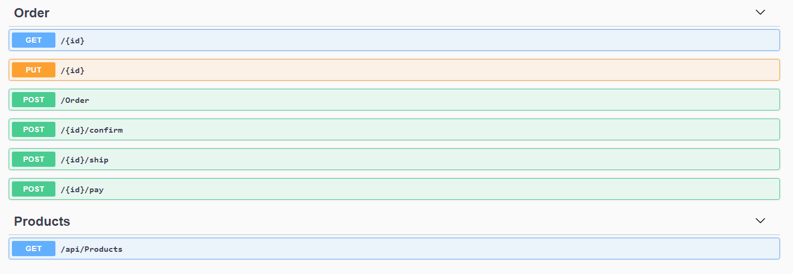

# Beginsituatie

## Situatieschets

We beschrijven hieronder het deel dat in de code is opgenomen.

Buyyu is een bedrijf gespecialiseerd in het verkopen van bureaus en bureaustoelen om grote kantoren in te richten. De order desk krijgt de bestellingen binnen via de sales departement en zetten deze in de complete status als deze klaar is om te verzenden.

Het magazijn zorgt voor de verzending, maar er moet wel genoeg voorraad zijn. Indien na het verzenden de stock van een product onder de 100 items daalt dan wordt er automatisch een nieuwe bestelling geplaatst. We gaan er hiervan uit dat de levering onmiddellijk plaats vindt en de stock weer verhoogd wordt.

Wanneer er een betaling binnenkomt wordt deze geregistreerd in het systeem.

Bij elke stap moet de klant een e-mail krijgen.


We concentreren ons op en beperken ons tot de order service. De andere contexten, product catalogus en magazijn, zijn bijkomende contexten die niet verder uitgewerkt zijn.

## Database model

De kans is groot dat de developer bij het horen van dit verhaal een papier genomen heeft en volgend databasemodel getekend heeft:


Vanuit het database-model maakt de developer dan zijn classes op.

## Solution overzicht

Open de in de src-folder de buyyu.sln. Deze heeft de volgende 5 projecten:

1. buyyu.web: dit is onze api en tevens start-project. De focus ligt niet op dit project, dus is deze niet uitgewerkt om bijvoorbeeld REST-compliant te zijn. We hebben wel Swagger UI tot onze beschikking zodat we in de browser kunnen testen.
2. buyyu.Models: Hier kan je de dto's terug vinden die in verschillende lagen gebruikt worden. Er zijn geen aparte dto's aangemaakt voor aanmaken en aanpassen van resources.
3. buyyu.BL: hier zit de business logica geprogrammeerd. Er zijn 4 services:
   1. OrderService: deze bevat allerlei methodes om orders aan te maken, aan te passen, te verzenden of te betalen
   2. ProductService: voor het ophalen van de product catalogus
   3. WarehouseService: voor het beheer van de stock
   4. MailService: voor het verzenden van mails
4. buyyu.Data: de data-laag met de entities en de DbContext.
5. buyyu.Tests: met enkele unit testen.

Dit is dus een klassieke layer aanpak.

## Starten

Voer eerst volgend command uit in de "Package Manager Console" om de database aan te maken en data te seeden:

```
Update-Database
```

Zet project buyyu.Web als startup project en start het project.

Normaal opent de Swagger UI nu in de browser:




Om de product catalogus te bekijken, voer de Get Products uit:

```json
[
  {
    "productId": "5ca659b1-25b1-45c1-9755-3a3cd8591b9e",
    "name": "Desk Techni",
    "description": "The Techni Mobili Complete Workstation Desk is everything you need in a computer desk and stay organized.",
    "price": 295,
    "available": 100
  },
  {
    "productId": "32f75bce-16a0-4070-9fac-4289678c191f",
    "name": "Office Chair Manager",
    "description": "The Lockland Big & Tall bonded leather managers chair offers top quality comfort, multiple adjustment features.",
    "price": 263,
    "available": 145
  },
  {
    "productId": "bcbc1851-6317-4022-be62-53d29c04bcda",
    "name": "Vintage Desk",
    "description": "Carve out a personal workspace with this storage desk. The simple design and classic mid-century modern details make this desk perfect for modern decor themes or casual open office settings, and the rectangular desktop provides space for a laptop and peripherals.",
    "price": 305,
    "available": 179
  },
  {
    "productId": "de679c55-4c13-4fe7-91b4-69cbce3223a2",
    "name": "Office Chair Beta",
    "description": "Implement an ergonomic seating solution for your office with this maroon multipurpose chair. The included tilt tension knob lets you calibrate the tilt and recline resistance to your desired configuration, while the adjustable seat and armrests optimize your seating position for correct posture.",
    "price": 169,
    "available": 213
  }
]
```

Onder Post Order kunnen we bijvoorbeeld de volgende body uitvoeren om een order aan te maken:

```json
{
  "clientId": "3fa85f64-5717-4562-b3fc-2c963f66afa6",
  "orderlines": [
    {
      "productId": "bcbc1851-6317-4022-be62-53d29c04bcda",
      "qty": 10
    },
    {
      "productId": "de679c55-4c13-4fe7-91b4-69cbce3223a2",
      "qty": 20
    }
  ]
}
```

We krijgen dan normaal gezien een 200 status terug met de volgende response:

```json
{
  "orderId": "a47dced5-a2fc-431a-bdda-6bf4ac665bbe",
  "clientId": "3fa85f64-5717-4562-b3fc-2c963f66afa6",
  "orderStateId": "bd8be3d2-8028-45e2-a211-bf737a2508c1",
  "orderDate": "2021-02-22T19:45:32.6606407",
  "totalAmount": 6430,
  "paidAmount": 0,
  "state": "NEW",
  "orderlines": [
    {
      "orderlineId": "4b9ec976-0197-4231-84e0-7c6c7d37a759",
      "productId": "de679c55-4c13-4fe7-91b4-69cbce3223a2",
      "price": 169,
      "qty": 20
    },
    {
      "orderlineId": "03f03028-638d-4f58-9f83-9fafc167cff9",
      "productId": "bcbc1851-6317-4022-be62-53d29c04bcda",
      "price": 305,
      "qty": 10
    }
  ]
}
```

We kunnen de order bevestigen door Order/a47dced5-a2fc-431a-bdda-6bf4ac665bbe/confirm uit te voeren, met als volgende response:

```json
{
  "orderId": "a47dced5-a2fc-431a-bdda-6bf4ac665bbe",
  "clientId": "3fa85f64-5717-4562-b3fc-2c963f66afa6",
  "orderStateId": "82d9ce01-9f25-48b1-8af3-93f52426676f",
  "orderDate": "2021-02-22T19:47:07.0611767",
  "totalAmount": 6430,
  "paidAmount": 0,
  "state": "CNF",
  "orderlines": [
    {
      "orderlineId": "4b9ec976-0197-4231-84e0-7c6c7d37a759",
      "productId": "de679c55-4c13-4fe7-91b4-69cbce3223a2",
      "price": 169,
      "qty": 20
    },
    {
      "orderlineId": "03f03028-638d-4f58-9f83-9fafc167cff9",
      "productId": "bcbc1851-6317-4022-be62-53d29c04bcda",
      "price": 305,
      "qty": 10
    }
  ]
}
```

Voor de verzending uit te voeren doen we Order/a47dced5-a2fc-431a-bdda-6bf4ac665bbe/ship, met als volgende response:

```json
{
  "orderId": "a47dced5-a2fc-431a-bdda-6bf4ac665bbe",
  "clientId": "3fa85f64-5717-4562-b3fc-2c963f66afa6",
  "orderStateId": "4b5549bb-b1b2-4964-9818-da984baab4ff",
  "orderDate": "2021-02-22T19:47:07.0611767",
  "totalAmount": 6430,
  "paidAmount": 0,
  "state": "SHP",
  "orderlines": [
    {
      "orderlineId": "4b9ec976-0197-4231-84e0-7c6c7d37a759",
      "productId": "de679c55-4c13-4fe7-91b4-69cbce3223a2",
      "price": 169,
      "qty": 20
    },
    {
      "orderlineId": "03f03028-638d-4f58-9f83-9fafc167cff9",
      "productId": "bcbc1851-6317-4022-be62-53d29c04bcda",
      "price": 305,
      "qty": 10
    }
  ]
}
```

Tenslotte wordt een betaling als volgt in gegeven: Order/a47dced5-a2fc-431a-bdda-6bf4ac665bbe/pay met als body 6430, en volgende response wordt ontvangen:

```json
{
  "orderId": "a47dced5-a2fc-431a-bdda-6bf4ac665bbe",
  "clientId": "3fa85f64-5717-4562-b3fc-2c963f66afa6",
  "orderStateId": "4b5549bb-b1b2-4964-9818-da984baab4ff",
  "orderDate": "2021-02-22T19:47:07.0611767",
  "totalAmount": 6430,
  "paidAmount": 6430,
  "state": "SHP",
  "orderlines": [
    {
      "orderlineId": "4b9ec976-0197-4231-84e0-7c6c7d37a759",
      "productId": "de679c55-4c13-4fe7-91b4-69cbce3223a2",
      "price": 169,
      "qty": 20
    },
    {
      "orderlineId": "03f03028-638d-4f58-9f83-9fafc167cff9",
      "productId": "bcbc1851-6317-4022-be62-53d29c04bcda",
      "price": 305,
      "qty": 10
    }
  ]
}
```

## Taken

1. Speel met de applicatie via Swagger UI of Postman om er bekend mee te raken. Niet alle scenario's zijn afgedekt, indien er zich een fout voordoet, voel u vrij om correcties aan te brengen.
2. Bekijk de code, waar wordt wat aangeroepen.
3. Voer de unit testen uit.

## Volgende stap

We gaan dit project nu stap voor stap verbeteren. In de volgende stap gaan we encapsulation inbouwen via private setters en methods verplaatsen van de service naar onze domain objecten. Dit heeft nog een aantal andere implicaties zoals hoe we de unit testen moeten mocken.