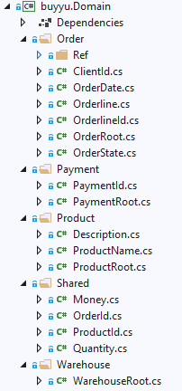

# Domain Driven Design

In dit hoofdstuk trachten we drie technische componenten van DDD te implementeren:

1. Aggregate root
2. Invariants
3. Value objects

Eerst en vooral nog eens benadrukken dat DDD veel breder is dan deze technische implementaties. Het gaat om design, over het modeleren van een probleem naar een oplossing. Het ecosysteem van DDD is door de jaren heen ook stevig gegroeid. Bijvoorbeeld, het is belangrijk dat developers dezelfde duidelijke en ondubbelzinnige taal spreken als de business, daarom is het techno-sociale aspect ook heel belangrijk.

Uit het modeleren, bijvoorbeeld door gebruik van Event Storming [1], komen een aantal Bounded Contexten te voorschijn. Binnen deze Bounded Context spreekt men eenzelfde taal, die kan verschillen van een andere Bounded Context ook al is die in dezelfde oplossing opgenomen. Bijvoorbeeld: als je een koffie besteld in Rome krijg je wellicht een straffe koffie in een kleine tas, terwijl je in New York een grote beker met zoetere koffie krijgt. Of dichter bij huis, het verschil van het woord bank en zetel bij Vlamingen en Nederlanders. Met andere woorden, taal heeft zijn grenzen.
Een product voor de marketing afdeling is voor hun alles wat gerelateerd is met de product catalogus, terwijl voor de pricing manager enkel de prijs telt, en voor de magazijnier hoeveel items van dat product nog in stock zijn.
Vertaald naar het technische spreken we niet meer van een Bounded Context, maar van een Aggregate. Deze Aggregate bestaat uit één of meerdere domain entities die als het ware aan elkaar hangen. Per Aggregate is er ook één Aggregate Root. In principe gebeuren alle acties in een Aggregate, altijd via de Aggregate Root. 
In ons model hebben we een Order en verschillende Orderlines die daaronder hangen. Een Orderline kan niet bestaan zonder een Order en als we een Orderline willen toevoegen, aanpassen of verwijderen, dan gaan we de dit altijd doen via de Order en nooit rechtstreeks op de Orderline.

Een belangrijke taak van de Aggregate Root is ook om te controleren of hij altijd in een valid state is. Als bijvoorbeeld de Order status aangepast wordt naar confirmed, dan moéten er Orderlines zijn. Deze validatieregels zijn direct te mappen met de business rules, en daarom horen ze ook thuis in de Aggregate Root en we noemen ze Invariants. 
Deze regels worden ook in de front-end afgedwongen.
Er zijn ook regels die buiten de context vallen, zoals de controle of er wel genoeg stock aanwezig is vooraleer een Order kan verzonden worden. Deze kunnen perfect een laag hoger afgedwongen worden, aangezien dit ook deel uitmaakt van DDD. 

Soms zijn er validatieregels die zeer gericht zijn tot één property. Soms is zijn er ook properties die een groep kunnen zijn, zoals Streetname, Housenumber, PostalCode en City wat kan samengenomen worden tot Address. Voor deze (en meer) gevallen, kan je gebruik maken van Value objects. In tegenstelling tot domain entiteiten die een identity property hebben (vb ID), hebben Value objects geen identity property. Hun identiteit wordt verkregen door hun waarde. Bijvoorbeeld: 5 euro is 5 euro. De eerste 5 euro echter is samengesteld door 5 stukken van 1 euro, en de tweede 5 euro is een biljet van 5 euro. 
Value objects zijn ook immutable en we maken ze aan via een factory method, waar we al validaties kunnen uitvoeren. [2]

Hoog tijd om deze concepten toe te passen in ons project.

## Buyyu project

### Wat zijn de bounded contexts?

Als we even terug kijken naar onze applicatie, dan kan je veel meer contexten of groepen van functionaliteit herkennen dan we in de originele opzet gebruiken en onder onze order geplaatst hebben.

We onderscheiden:

- Order: om de bestelling samen te stellen, te valideren, en op te volgen
- Product: om de productcatalogus te bekijken
- Warehouse: om de bestelling uit de stock te halen en te verzenden en stock aan te vullen
- Payment: om de factuur te betalen

### DDD root base class

Voor onze entities en aggregate roots hebben we een aantal base classes nodig. Deze zitten in een apart project:


<u>Value</u>

De basis value object is eentje die we algemeen gebruikt wordt als abstract class voor value objects. Het dient om de properties van de onze value object te kunnen vergelijken.

```c#
public abstract class Value<T> where T : Value<T>
{
	public override bool Equals(object other)
	{
		if (other is null) return false;
		if (ReferenceEquals(this, other)) return true;

		return other.GetType() == typeof(T) && Members.All(
				m =>
				{
					var otherValue = m.GetValue(other);
					var thisValue = m.GetValue(this);

					return m.IsNonStringEnumerable
						? GetEnumerableValues(otherValue).SequenceEqual(GetEnumerableValues(thisValue))
						: otherValue?.Equals(thisValue) ?? thisValue == null;
				}
			);
	}

	public static bool operator ==(Value<T> left, Value<T> right) => Equals(left, right);

	public static bool operator !=(Value<T> left, Value<T> right) => !Equals(left, right);

	public override string ToString()
	{
		if (Members.Length == 1)
		{
			var m = Members[0];
			var value = m.GetValue(this);

			return m.IsNonStringEnumerable ? $"{string.Join("|", GetEnumerableValues(value))}" : value.ToString();
		}

		var values = Members.Select(
			m =>
			{
				var value = m.GetValue(this);

				return m.IsNonStringEnumerable ?
					$"{m.Name}:{string.Join("|", GetEnumerableValues(value))}"
					: m.Type != typeof(string) ? $"{m.Name}:{value}" : value == null ? $"{m.Name}: null" : $"{m.Name}:\'{value}\'";
			}
		);

		return $"{typeof(T).Name}[{string.Join("|", values)}]";
	}

	public override int GetHashCode()
	{
		return CombineHashCodes(
				Members.Select(m => m.IsNonStringEnumerable ? CombineHashCodes(GetEnumerableValues(m.GetValue(this))) : m.GetValue(this)));
	}

	private static IEnumerable<object> GetEnumerableValues(object obj)
	{
		var enumerator = ((IEnumerable)obj).GetEnumerator();
		while (enumerator.MoveNext()) yield return enumerator.Current;
	}

	private static int CombineHashCodes(IEnumerable<object> objs)
	{
		unchecked
		{
			return objs.Aggregate(17, (current, obj) => current * 59 + (obj?.GetHashCode()) ?? 0);
		}
	}

	#region Members

	private static readonly Member[] Members = GetMembers().ToArray();

	private static IEnumerable<Member> GetMembers()
	{
		var t = typeof(T);
		const BindingFlags flags = BindingFlags.Instance | BindingFlags.Public;

		while (t != typeof(object))
		{
			if (t == null) continue;

			foreach (var p in t.GetProperties(flags)) yield return new Member(p);
			foreach (var f in t.GetFields(flags)) yield return new Member(f);

			t = t.BaseType;
		}
	}

	private struct Member
	{
		public readonly string Name;
		public readonly Func<object, object> GetValue;
		public readonly bool IsNonStringEnumerable;
		public readonly Type Type;

		public Member(MemberInfo info)
		{
			switch (info)
			{
				case FieldInfo field:
					Name = field.Name;
					GetValue = obj => field.GetValue(obj);

					IsNonStringEnumerable = typeof(IEnumerable).IsAssignableFrom(field.FieldType) && field.FieldType != typeof(string);

					Type = field.FieldType;

					break;

				case PropertyInfo prop:
					Name = prop.Name;
					GetValue = obj => prop.GetValue(obj);

					IsNonStringEnumerable = typeof(IEnumerable).IsAssignableFrom(prop.PropertyType) && prop.PropertyType != typeof(string);

					Type = prop.PropertyType;

					break;

				default:
					throw new ArgumentException("Member is not a field or propert!", info.Name);
			}
		}
	}

	#endregion Members
}
```

<u>Entity</u>

Een entity heeft een ID, in tegenstelling tot een Value Object. Dus we zorgen ervoor dat we altijd een ID hebben onze entities:

```c#
public abstract class Entity<TKey> where TKey : Value<TKey>
{
	public TKey Id { get; protected set; }
}
```

<u>Aggregate Root</u>

Boven op de object graph van onze aggregate zit de aggregate root. Deze is een entity die alle andere onderliggende entities aanstuurt. Bovendien moet de aggregate root er zich van vergewissen dat hij in een geldige staat is:

```c#
public abstract class AggregateRoot<TKey> : Entity<TKey> where TKey : Value<TKey>
{
	protected abstract void EnsureValidation();
}
```

### Aanmaak domain project

We maken nu nog een ander project aan om onze domain objecten, de entities, aggregate roots en value objects, te plaatsen. We halen deze dan ook fysiek uit het data project, dewelke dan enkel voor infrastructuur-laag is.

Om direct duidelijk te maken welke onze aggregates zijn, kunnen we per aggregate een aparte folder aanmaken. De aggregate root van deze aggregates hernoemen we ook met de prefix root (mede omdat je ook niet dezelfde class name als zijn namespace kan gebruiken).



<u>Shared kernel</u>

Het kan zijn dat er enkele value objects gedeeld worden over de verschillende domain objecten. Deze worden dan in de shared kernel geplaatst. Het is altijd een afweging of een value object kan verhuizen van een aggregate naar een shared kernel. Geadviseerd is om er zeer defensief mee om te springen. Een "Description" value object kan bijvoorbeeld er geplaatst worden als twee agregates dit gebruiken, maar wat als de validatie anders is tussen beide (vb de ene mag max 500 tekens hebben en de andere 2500)? Wat als de business rules veranderen per aggregate? En een algemene "Description" voor een productbeschrijving tov een wagbeschrijving past niet, dit zijn twee essentieel verschillende begrippen.

Hier is er voor gekozen om Money, OrderId, ProductId en Quantity samen te nemen.

<u>Value objects</u>

Value objects zijn immutable, en in deze code worden ze aangemaakt door static factory methods. Het zegt meer over wat we willen doen bijvoorbeeld een object aanmaken startende van een string (FromString) dan gewoon een constructor new().

Als voorbeeld het Money value object:

```c#
public class Money : Value<Money>
{
	public decimal Amount { get; }
	public string Currency { get; }

	//Satisfy EF Core
	private Money() { }

	private Money(decimal amount, string currency)
	{
		if (string.IsNullOrEmpty(currency))
		{
			throw new ArgumentNullException($"'{nameof(currency)}' cannot be null or empty", nameof(currency));
		}

		Amount = amount;
		Currency = currency;
	}

	public static Money FromDecimalAndCurrency(decimal amount, string currency) => new Money(amount, currency);

	public static Money Empty(string currency) => new Money(0, currency);

	public override string ToString()
	{
		return ToString("post");
	}

	private string ToString(string format)
	{
		var strAmount = Amount.ToString("0.##");
		if (format.ToLowerInvariant() == "pre")
		{
			return $"{Currency} {strAmount}";
		}
		else
		{
			return $"{strAmount} {Currency}";
		}
	}

	public static Money operator +(Money mny1, Money mny2)
	{
		if (mny1.Currency != mny2.Currency)
		{
			throw new InvalidOperationException("Cannot add money with different currencies");
		}

		return new Money(mny1.Amount + mny2.Amount, mny1.Currency);
	}
}
```

In dit value object zijn er twee properties: 

- Amount
- Currency

Geld wordt namelijk altijd uitgedrukt in een bedrag en, soms impliciet, de valuta. Met de volgende stelregel in gedachte "Make the implicit explicit" en aangezien bedrag en valuta altijd hand in hand gaan, kan dit als één value object beschouwd worden.

Er zijn twee factory methods:

- FromDecimalAndCurrency
- Empty

Er kan natuurlijk gekozen worden om dit te vervangen door new(250m, "EUR") en new(0m, "EUR"), maar het leest beter in code als factory methods gebruikt worden.

Er kunnen ook methods overriden worden, zoals bijvoorbeeld ToString() met de optie om de valuta voor of na het bedrag te plaatsen.

Operators kunnen ook aangemaakt worden, zoals in het voorbeeld + waarbij twee Money objecten met elkaar opgeteld kunnen worden als deze dezelfde valuta hebben.

Een andere mogelijkheid is om implicit en/of explicit operators toe te voegen:

```c#
public static implicit operator Guid(OrderId orderId) => orderId.Value;
```

Het is ook belangrijk even aandacht te besteden aan OrderState. Voorheen was OrderState een entity in de database met alle mogelijke status waarden van Order en was er dus ook een relatie gelegd van Order naar OrderState. Echter, OrderState is een referentie tabel, en in onze code wordt er ook gebruik gemaakt van de order status om beslissingen te nemen. De kans dat Order statussen veranderen in de toekomst, en de kans dat als er een Order status bijkomt dat er hieraan codewijzigingen aan gekoppeld zijn, zijn zeer groot.

Er wordt dan gebruikt gemaakt van enumerations in een value object zodat deze business logica in het domein zit vervat:

```c#
public class OrderState : Value<OrderState>
{
	public OrderStateEnum Value { get; private set; }

	//Satisfy EF Core
	private OrderState()
	{
	}

	private OrderState(OrderStateEnum orderStateEnum)
	{
		Value = orderStateEnum;
	}

	public static OrderState FromEnum(OrderStateEnum orderStateEnum) => new OrderState(orderStateEnum);

	public static implicit operator OrderStateEnum(OrderState orderState) => orderState.Value;

	public bool IsNewState() => OrderStateEnum.NEW == Value;

	public bool IsConfirmedState() => OrderStateEnum.CNF == Value;

	public bool IsShippedState() => OrderStateEnum.SHP == Value;

	public override string ToString()
	{
		return Value.ToString("G");
	}

	public enum OrderStateEnum
	{
		NEW,
		CNF,
		SHP
	}
}
```

Op de vraag dat op het scherm er iets anders moet getoond worden dan "NEW", "CNF" of "SHP" is volledig te bekijken langs de read-side van de applicatie. Daar kunnen perfect deze waarden omgezet worden naar iets wat leesbaar is op het scherm voor gebruikers en deze waarden worden doorgegeven via een dto.

<u>Aggregate root</u>

Kijkende naar het OrderRoot object kan vastgesteld worden dat de properties nu geen primitieve types meer zijn, maar allemaal of value objects, of entities:

```c#
public ClientId ClientId { get; private set; }
public OrderDate OrderDate { get; private set; }
public Money TotalAmount { get; private set; }
public Money PaidAmount { get; private set; }
public OrderState State { get; private set; }
public List<Orderline> Lines { get; private set; }
```

Qua methods krijgen we nu ook in de plaats van primitive types value objects binnen. Create(OrderId, ClientId) signature leest duidelijker dan Create(Guid, Guid). Bovendien voeren de value objects al validatie checks uit eer ze doorgegeven worden als parameters. Fail early.

```c#
public static OrderRoot Create(OrderId orderId, ClientId clientId)
{
	...
}

public void AddOrderline(ProductId productId, Money price, Quantity qty)
{
	...
	EnsureValidState();
}

public void UpdateOrderline(ProductId productId, Money price, Quantity qty)
{
	...
	EnsureValidState();
}

public void RemoveOrderline(ProductId productId)
{
	...
	EnsureValidState();
}

public void Confirm()
{
	...
	EnsureValidState();
}

public void MarkShipped()
{
	if (!State.IsConfirmedState())
	{
		throw new InvalidOperationException("Cannot confirm not confirmed order");
	}

	State = OrderState.FromEnum(OrderState.OrderStateEnum.SHP);
	OrderDate = OrderDate.Now();

	EnsureValidState();
}

public void MarkPaid(Money amount)
{
	if (State.IsNewState())
	{
		throw new InvalidOperationException("Cannot pay not confirmed order");
	}

	PaidAmount += amount;

	EnsureValidState();
}
```

Er zijn nog twee opvallende aanpassingen gebeurd:

1. MarkShipped en MarkPaid doen nu niet de verzending en betaling meer, maar veranderen enkel de state van een Order.
2. Elke methode sluit af met een call naar EnsureValidState()

```c#
protected override void EnsureValidState()
{
	var isValid = true;

	if (Id == null) isValid = false;
	if (ClientId == null) isValid = false;
	if (OrderDate == null) isValid = false;
	if (PaidAmount == null) isValid = false;
	if (Lines == null) isValid = false;

	if (!State.IsNewState())
	{
		if (Lines.Count == 0) isValid = false;
	}

	if (!isValid)
	{
		throw new AggregateRootInvalidStateException();
	}
}
```

Dit telkens aanroepen, kan natuurlijk vergeten worden. In een volgend hoofdstuk wordt dit beter opgevangen.

### Service layer

In de service layer zijn er een aantal services bijgekomen om het werk op te vangen voor het magazijn en de betalingen:


### Insfrastucture layer: data

In de data layer zijn de enitities verhuisd naar de Domain layer. Dit betekent dat hier enkel nog configuratie en repositories over blijven.

Aangezien er gewerkt wordt met Entity Framwork Core is de techniek om value objects te beschouwen als onderdeel van een andere entity "owned type". Bij Entity Framework 6 is dat "complex type".

Dit is een voorbeeld om een owned type te configureren:

```c#
mb.OwnsOne(
	ol => ol.TotalAmount,
	totalAmount =>
	{
		totalAmount.Property(p => p.Amount).HasColumnName("TotalAmount");
		totalAmount.Property(p => p.Currency).HasColumnName("TotalAmount_Currency");
	});
```

Om data toe te voegen (seeding) is er een speciale techniek voor handen voor owned types. Eerst moeten de id's toegevoegd worden, vervolgens kan er op de owned type data toegvoegd worden met de shadow id van de entitiy, in de vorm van <ClassName><IdName>:

```c#
mb.HasData(
		new { Id = ProductId.FromString("de679c55-4c13-4fe7-91b4-69cbce3223a2") },
		new { Id = ProductId.FromString("32f75bce-16a0-4070-9fac-4289678c191f") },
		new { Id = ProductId.FromString("bcbc1851-6317-4022-be62-53d29c04bcda") },
		new { Id = ProductId.FromString("5ca659b1-25b1-45c1-9755-3a3cd8591b9e") }
	);

mb.OwnsOne(
	pr => pr.Name,
	name =>
	{
		name.Property(x => x.Value).HasColumnName("Name");
		name.HasData(
			new { ProductRootId = ProductId.FromString("de679c55-4c13-4fe7-91b4-69cbce3223a2"), Value = "Office Chair Beta" },
			new { ProductRootId = ProductId.FromString("32f75bce-16a0-4070-9fac-4289678c191f"), Value = "Office Chair Manager" },
			new { ProductRootId = ProductId.FromString("bcbc1851-6317-4022-be62-53d29c04bcda"), Value = "Vintage Desk" },
			new { ProductRootId = ProductId.FromString("5ca659b1-25b1-45c1-9755-3a3cd8591b9e"), Value = "Desk Techni" }
		);
	});
```

Tenslotte, ID's zijn ook value objecten, echter zijn deze geen owned types in EF Core:

```c#
mb.HasKey(x => x.Id);
mb.Property(x => x.Id).HasConversion(x => x.Value, s => ProductId.FromGuid(s));
```

### Unit testen

Nu er value objects en aggregates zijn, kunnen hierop veel kleinere unit tests geschreven worden die zeer nauw bij de business rules van de domain experten ligt.

Voorbeeld voor een value object:

```c#
public void CreateMoney()
{
	//Arrange
	var amount = 100m;
	var currency = "EUR";

	//Act
	var money = Money.FromDecimalAndCurrency(amount, currency);

	//Assert
	Assert.That(money.Amount, Is.EqualTo(amount));
	Assert.That(money.Currency, Is.EqualTo(currency));
}

public void NoEmptyCurrencyAllowed()
{
	Assert.Throws<ArgumentNullException>(() => Money.FromDecimalAndCurrency(0m, ""));
}
```

Voorbeeld van aggregate root:

```c#
[Test]
public void CreateValidOrder()
{
	//Arrange
	var clientId = ClientId.FromString("031c7ca8-ecab-475a-a207-ce02c7addefc");
	var orderId = OrderId.FromString("e8959fda-3d46-4d74-8f1a-58a408ccf62e");

	//Act
	var order = OrderRoot.Create(orderId, clientId);

	//Assert
	Assert.That(order.ClientId, Is.EqualTo(clientId));
	Assert.That(order.Id, Is.EqualTo(orderId));
}

[Test]
public void AddOrderline()
{
	//Arrange
	var clientId = ClientId.FromString("031c7ca8-ecab-475a-a207-ce02c7addefc");
	var orderId = OrderId.FromString("e8959fda-3d46-4d74-8f1a-58a408ccf62e");
	var order = OrderRoot.Create(orderId, clientId);

	var productId = ProductId.FromString("02ad2005-1cb8-4bcc-ae0e-4d9eefabadd8");
	var price = Money.FromDecimalAndCurrency(100m, "EUR");
	var quantity = Quantity.FromInt(5);

	//Act
	order.AddOrderline(productId, price, quantity);

	//Arrange
	Assert.That(order.Lines.Count, Is.EqualTo(1));
	Assert.That(order.Lines[0].ProductId, Is.EqualTo(productId));
	Assert.That(order.Lines[0].Price, Is.EqualTo(price));
	Assert.That(order.Lines[0].Qty, Is.EqualTo(quantity));
}
```


## Taken

1. Voer Update-Database uit om de database configuratie aan te passen. In het echte leven zullen er wel migratiescripts moeten geschreven worden aangezien nu wat vroegere data verloren gaat.

## Volgende stap

Er is nog iets niet in orde in deze opzet. Eerst en vooral lopen de updates en reads door elkaar. Er is, ondanks de dependency injection, nog steeds een directe koppeling met de andere laag. In het volgende hoofdstuk wordt er aandacht besteed aan CQRS, waarbij commands en reads van elkaar gescheiden worden in aparte klasses, en is er een ontkoppeling van de infrastructure layer van de binnenste lagen.

## Referenties

[1]: https://www.eventstorming.com/	"Event Storming (Brandolini)"
[2]: https://docs.microsoft.com/en-us/dotnet/architecture/microservices/microservice-ddd-cqrs-patterns/implement-value-objects	"Implement value objects"

